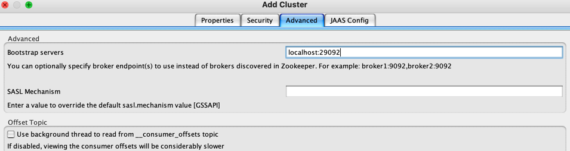
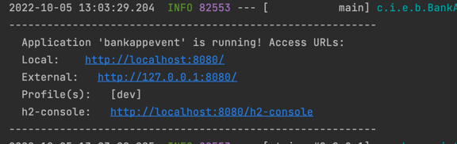
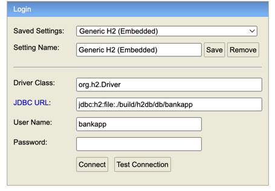
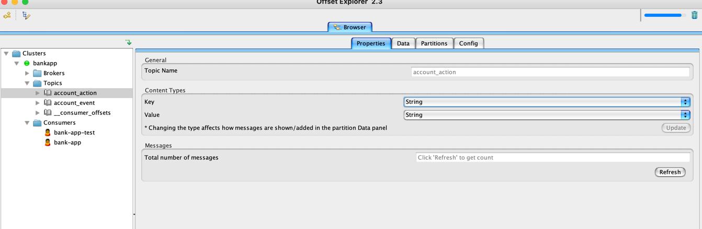
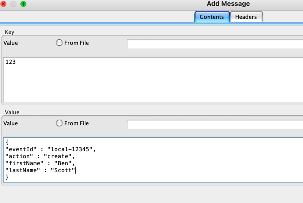
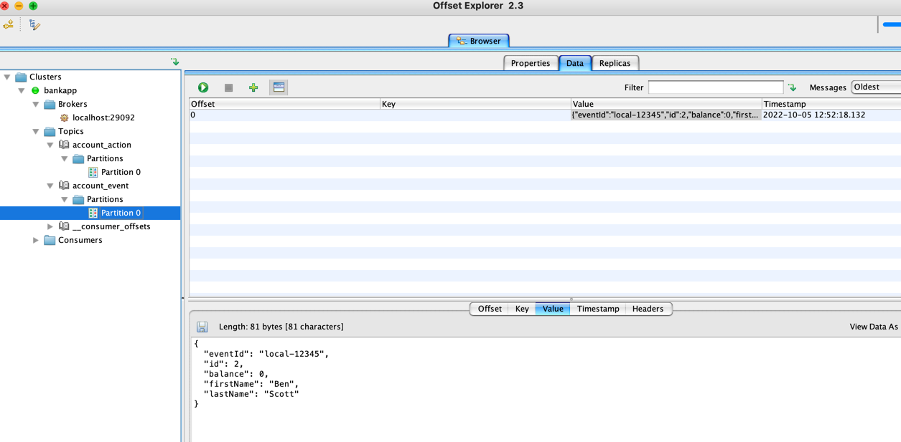

## Spring Boot workshop

This repo is designed with the following learning objectives:

* Spring Boot Overview
* Dependency injection
* Event Driven Architecture
* Hexagonal Architecture
* Testing

## Installation

* JDK 11
* Gradle
* Docker (or Rancher for M1)
* [Offset Explorer](https://www.kafkatool.com/download.html)

## Setup Offset Explorer

Start the kafka container:

`docker-compose -f docker/kafka.yml up -d`

Create a new cluster:
* Name: BankApp
* Advanced tab


## Bank Application

We are building a simple bank application. The business logic is kept simple so we can focus on the framework.

We have a couple features implemented:

### Create Account
 * Send an AccountStatusEvent to the topic `account_action` with the body:
 ```json
{
  "eventId" : String, // unique correlation ID
  "firstName" : String,
  "lastName" : String
}
```
An event will be published to `account_event` with the body:

```json
{
  "eventId" : String, // same as eventId from account_action
  "id" : int, // unique id for this account
  "firstName" : String,
  "lastName" : String,
  "balance" : BigDecimal // starts with 0.00 balance
}
```

### Get Account
* Send an AccountStatusEvent to the topic `account_action` with the body:
 ```json
{
  "eventId" : String, // unique correlation ID
  "id" : String, // account ID of the account
}
```
An event will be published to `account_event` with the body:

```json
{
  "eventId" : String, // same as eventId from account_action
  "firstName" : String,
  "lastName" : String,
  "balance" : BigDecimal // starts with 0.00 balance
}
```

## Task List:

* Implement depositing to an account
* Implement a 5% bonus on all deposit
* Implement withdrawal from an account

Bonus:
* Implement retrieving the last 10 transaction from an account
* Modify Kafka configuration to serialize/deserialize objects automatically

## Running the application

Ensure the kafka container is up:

`docker-compose -f docker/kafka.yml up -d`

Right click on `src/main/java/com/ippon/exercise/bankappevent/BankAppEventApplication.class` and choose run/debug.

### Viewing your DB
After the application starts you should see in the logs a link to your H2 database:
Click the link:



Configure JDBC url and UserName to be, and connect:


### Kafka manual instructions
The application will register the topics on startup. Configure them in your Offset Explorer to view data as String:


You can choose to publish events using the Offset Explorer, click on the green plus sign:


and send a single message:



after a couple seconds, you should see a message in the other topic:



This manual test can also be running [this test](src/test/java/com/ippon/exercise/bankappevent/acceptance/AccountCreationIntTests.java)

Refreshing the ACCOUNT table and you should see your account in the database.